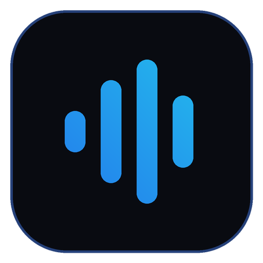

# Rave AI Desktop

A clean, dark-themed desktop chat client for a self-hosted LLM server. It's a thin
client — it talks to a Rave-AI-compatible HTTP API over the network, so the model
runs on your own machine or server, not in the app.



## Features

- **Login / accounts** stored locally; API keys encrypted with the OS keystore (Windows DPAPI)
- **Streaming chat** — replies appear token by token
- **Markdown + syntax-highlighted code blocks** with one-click copy
- **Model switcher** (if the server exposes multiple models)
- **Documents / Web toggles** for retrieval-augmented answers
- **Connect to any server** — localhost, a LAN box, or a remote host (e.g. via Cloudflare Tunnel)
- Pure client by default: it never starts a local model, it just connects

## Build

Requires [Node.js](https://nodejs.org) 18+.

```bash
npm install          # also fetches the bundled JS libs
npm start            # run in development
npm run build        # -> dist/RaveAI.exe  (single portable Windows file)
```

The build is size-optimized (strips unused Chromium locales and the DirectX
shader compiler), producing an ~80 MB portable exe.

## Point it at your server

Two ways:

1. **At sign-up** — enter your server URL and API key in the Create Account form.
2. **Config file** — set a default so a fresh install connects automatically.
   Edit `config/app.config.json` before building, or drop one at
   `%APPDATA%\Rave AI\app.config.json` after install:
   ```json
   { "defaultServerUrl": "https://your-server.example.com" }
   ```
   When the URL isn't localhost, the app is a pure client and won't try to start
   anything locally.

## Server API it expects

Any server implementing this subset works. Auth is `Authorization: Bearer <key>`.

| Method | Path | Purpose |
|--------|------|---------|
| GET | `/api/v1/health` | `{ "status": "online", "model_loaded": bool }` (no auth) |
| GET | `/api/v1/model` | current model info |
| GET | `/api/v1/models` | list of selectable models |
| POST | `/api/v1/models/active` | switch model (admin) |
| POST | `/api/v1/chat/stream` | SSE stream: `start` / `token` / `done` / `error` events |
| POST | `/api/v1/conversations` · GET/DELETE `/{id}` | conversation memory |
| GET/POST/DELETE | `/api/v1/documents` | RAG document management |
| GET | `/api/v1/websites` | approved sites for web retrieval |

The chat request body is `{ message, conversation_id?, temperature?, max_tokens?, use_rag?, use_web? }`.
The streaming response emits SSE events whose `data` is JSON (`{token}` for each piece,
`{conversation_id, response}` on `done`).

## Project layout

```
src/
  main.js       window, IPC, chat streaming, local storage
  preload.js    the only bridge exposed to the UI (window.rave)
  api.js        REST/SSE client
  store.js      encrypted JSON storage (OS keystore)
  auth/         local accounts + a swappable remote (website) provider
renderer/       index.html, styles.css, app.js  (the UI)
config/         app.config.json  (default server URL, auth mode)
assets/         app icon
scripts/        build helpers (copy-vendor, afterpack)
```

## Customizing sign-in

Accounts default to **local** (stored on the device). To back sign-in with your
own website instead, set `auth.mode` to `"remote"` and `auth.remoteBaseUrl` in
`config/app.config.json`; the contract is documented in `src/auth/remote.js`.

## License

MIT — see [LICENSE](LICENSE). Do what you like with it.
